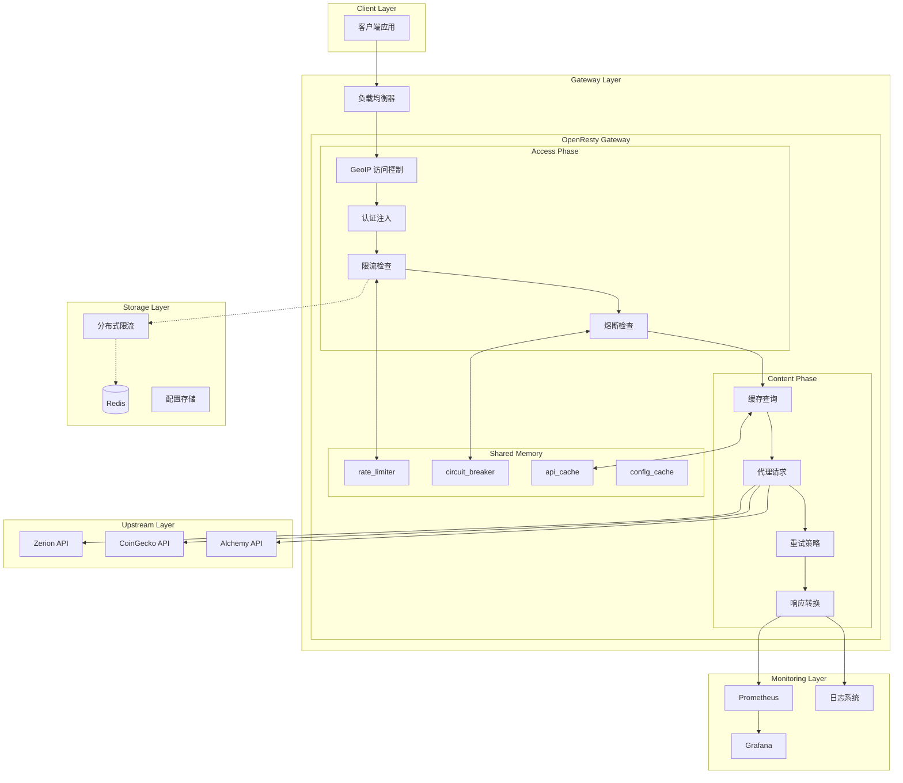
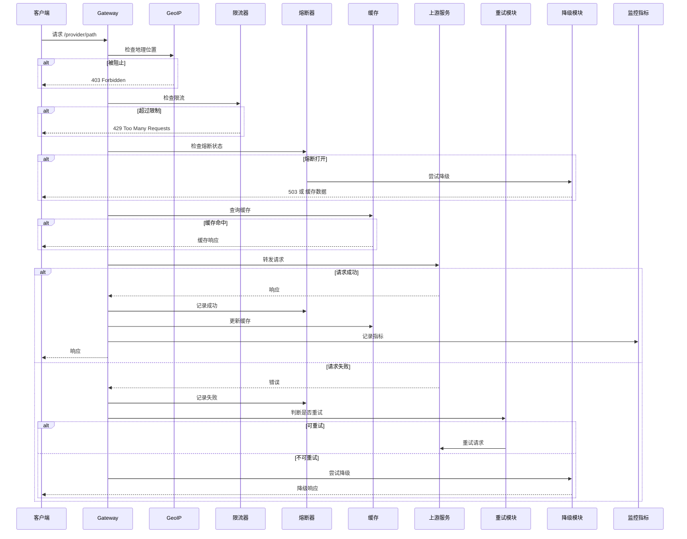
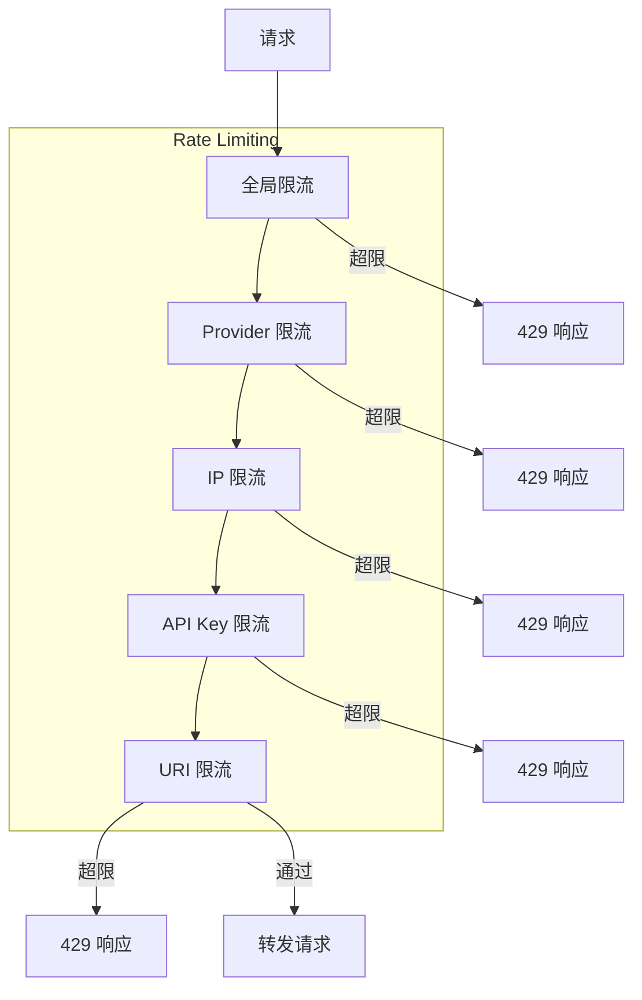
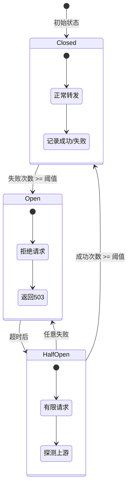
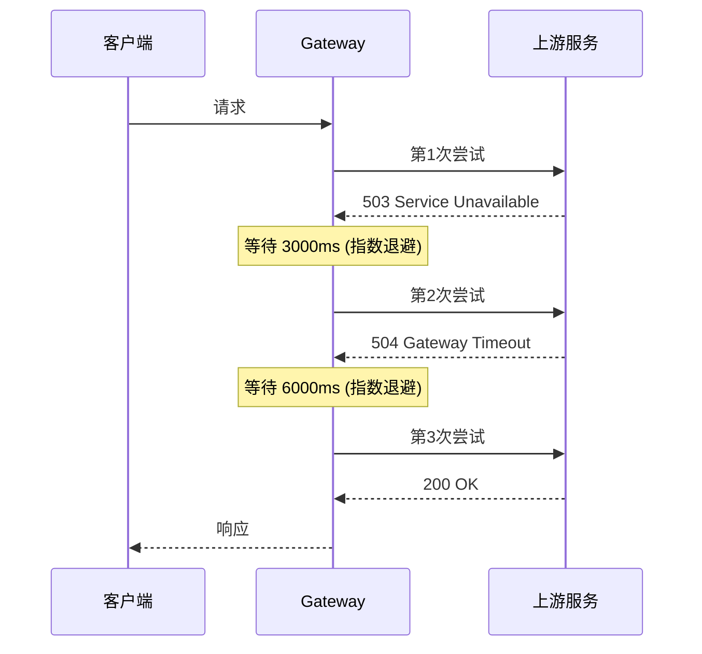
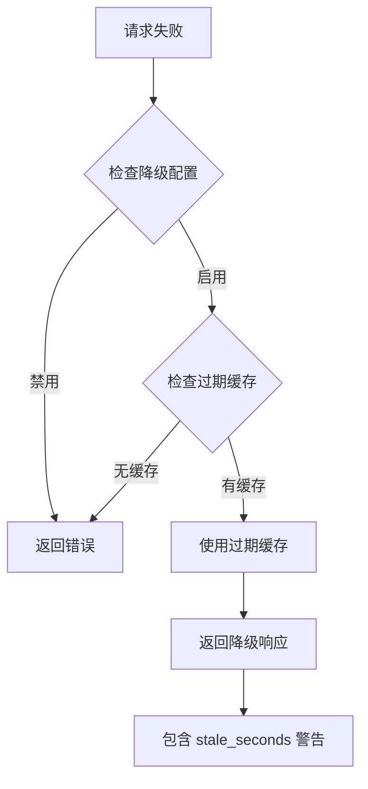
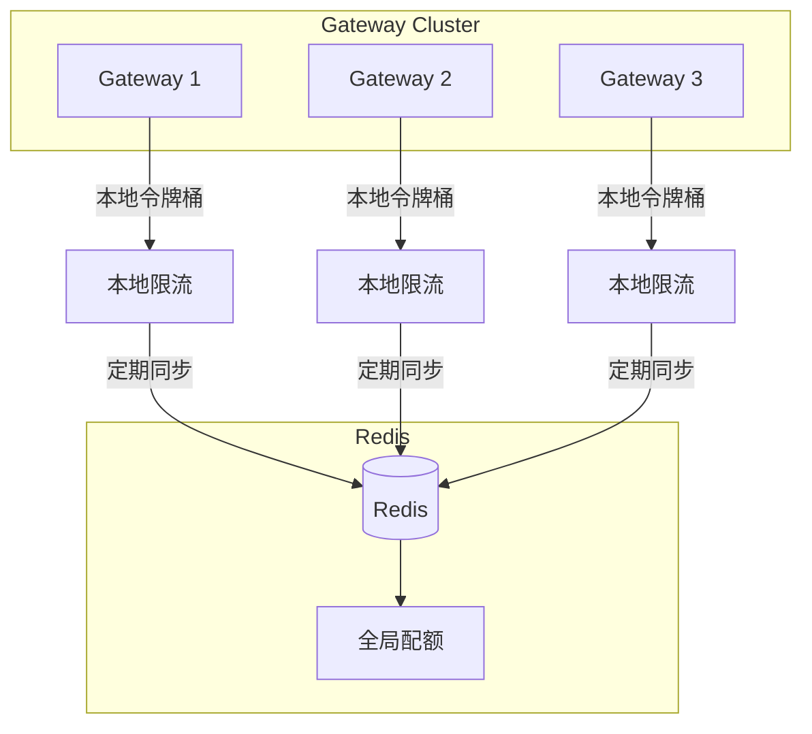

# OpenResty API Proxy Gateway

基于 OpenResty + Lua 实现的高性能第三方 API 代理网关，提供统一的 API 代理、认证注入、限流保护、熔断降级、监控告警等企业级功能。

## 目录

- [功能特性](#功能特性)
- [架构设计](#架构设计)
- [监控方案](#监控方案)
- [日志方案](#日志方案)
- [稳定性方案](#稳定性方案)
- [部署和配置](#部署和配置)
- [API 使用示例](#api-使用示例)
- [管理 API](#管理-api)
- [性能压测报告](#性能压测报告)

---

## 功能特性

| 功能 | 描述 |
|------|------|
| **路由转发** | 根据 URL 前缀将请求转发到不同的第三方服务 |
| **认证注入** | 支持多种认证方式（Basic Auth、Header、URL 拼接） |
| **多维度限流** | 全局/Provider/IP/API Key/URI 五维限流 |
| **分布式限流** | Redis + 本地令牌桶混合限流，支持多实例部署 |
| **熔断保护** | 基于 Circuit Breaker 模式的服务熔断 |
| **自动重试** | 带指数退避的智能重试策略 |
| **优雅降级** | 支持过期缓存降级，保证服务可用性 |
| **响应缓存** | 可配置的请求响应缓存 |
| **GeoIP 控制** | 基于地理位置的访问控制 |
| **监控指标** | Prometheus 格式的监控指标 |
| **结构化日志** | JSON 格式的访问日志，支持敏感信息脱敏 |
| **配置热更新** | 支持 Admin API 动态更新配置，无需重启 |
| **响应转换** | 统一响应格式，支持 Provider 特定转换 |

## 支持的 Provider

| 路径前缀 | 目标服务 | 认证方式 |
|---------|---------|---------|
| `/zerion/*` | `https://api.zerion.io/*` | Basic Auth (API Key 作为用户名) |
| `/coingecko/*` | `https://api.coingecko.com/*` | Header 传递 API Key |
| `/alchemy/*` | `https://eth-mainnet.g.alchemy.com/*` | API Key 拼接在 URL 路径 |

---

## 架构设计

### 整体架构图



### 请求处理流程



### 核心模块说明

| 模块 | 文件 | 职责 |
|------|------|------|
| 初始化模块 | [`lua/init.lua`](lua/init.lua) | 初始化 GeoIP 数据库、随机数种子 |
| 配置模块 | [`lua/config.lua`](lua/config.lua) | 统一配置管理，支持热更新 |
| 配置管理器 | [`lua/config_manager.lua`](lua/config_manager.lua) | 配置热加载、Redis 存储 |
| 代理处理器 | [`lua/proxy/handler.lua`](lua/proxy/handler.lua) | 核心请求处理逻辑 |
| 熔断器 | [`lua/circuit_breaker.lua`](lua/circuit_breaker.lua) | 服务熔断保护 |
| 限流器 | [`lua/rate_limiter.lua`](lua/rate_limiter.lua) | 本地令牌桶限流 |
| 分布式限流 | [`lua/distributed_rate_limiter.lua`](lua/distributed_rate_limiter.lua) | Redis + 本地混合限流 |
| 重试模块 | [`lua/retry.lua`](lua/retry.lua) | 指数退避重试策略 |
| 降级模块 | [`lua/degradation.lua`](lua/degradation.lua) | 优雅降级处理 |
| 缓存模块 | [`lua/cache/init.lua`](lua/cache/init.lua) | 响应缓存 |
| GeoIP 模块 | [`lua/geoip.lua`](lua/geoip.lua) | 地理位置访问控制 |
| 监控指标 | [`lua/metrics.lua`](lua/metrics.lua) | Prometheus 指标收集 |
| 响应转换 | [`lua/transformer/`](lua/transformer/) | 统一响应格式 |
| 管理 API | [`lua/admin/handler.lua`](lua/admin/handler.lua) | 管理接口处理 |

---

## 监控方案

### 监控架构

```mermaid
graph LR
    subgraph Gateway
        M[Metrics Module]
        H[/metrics 端点]
        HJ[/metrics/json 端点]
    end
    
    subgraph Prometheus
        P[Prometheus Server]
        P -->|抓取| H
        P -->|抓取| HJ
    end
    
    subgraph Grafana
        G[Grafana Dashboard]
        G -->|查询| P
    end
    
    subgraph Alerting
        A[AlertManager]
        A -->|告警| P
    end
    
    M -->|记录| H
    M -->|记录| HJ
```

### 可用指标

| 指标名称 | 类型 | 说明 |
|---------|------|------|
| `requests_total` | Counter | 请求总数 |
| `requests_by_provider` | Counter | 按 Provider 统计请求数 |
| `requests_by_status` | Counter | 按状态码统计请求数 |
| `requests_success` | Counter | 成功请求数 |
| `requests_failure` | Counter | 失败请求数 |
| `latency_bucket` | Histogram | 延迟分布直方图 |
| `latency_sum` | Summary | 延迟总和 |
| `latency_count` | Summary | 延迟计数 |
| `errors_by_type` | Counter | 按错误类型统计 |
| `cache_hit` | Counter | 缓存命中数 |
| `cache_miss` | Counter | 缓存未命中数 |
| `active_connections` | Gauge | 活跃连接数 |

### 延迟桶配置

```lua
-- 延迟桶边界（毫秒）
local latency_buckets = {10, 25, 50, 100, 250, 500, 1000, 2500, 5000, 10000}
```

### 监控端点

| 端点 | 格式 | 说明 |
|------|------|------|
| `/metrics` | Prometheus | Prometheus 格式指标 |
| `/metrics/json` | JSON | JSON 格式指标 |
| `/health` | JSON | 简单健康检查 |
| `/health/detailed` | JSON | 详细健康状态 |

### Grafana 接入指南（可选）

网关提供了 Prometheus 格式的监控指标，可以接入 Grafana 进行可视化监控。

#### 接入步骤

1. **部署 Prometheus**

```yaml
# prometheus.yml 示例配置
scrape_configs:
  - job_name: 'api-gateway'
    static_configs:
      - targets: ['api-gateway:80']
    metrics_path: '/metrics'
    scrape_interval: 15s
```

2. **部署 Grafana**

```bash
docker run -d \
  --name=grafana \
  -p 3000:3000 \
  -e GF_SECURITY_ADMIN_PASSWORD=admin \
  grafana/grafana
```

3. **配置数据源**

在 Grafana 中添加 Prometheus 数据源：
- URL: `http://prometheus:9090`
- Access: Server (default)

4. **创建 Dashboard**

推荐 Dashboard 面板配置：

| 面板名称 | 指标 | PromQL 示例 |
|---------|------|------------|
| 请求概览 | 总请求数 | `sum(rate(requests_total[5m]))` |
| 成功率 | 成功/失败比例 | `sum(rate(requests_success[5m])) / sum(rate(requests_total[5m]))` |
| 延迟分布 | P95/P99 延迟 | `histogram_quantile(0.95, rate(latency_bucket[5m]))` |
| Provider 统计 | 各 Provider 请求量 | `sum by (provider) (rate(requests_by_provider[5m]))` |
| 错误统计 | 按类型错误数 | `sum by (type) (rate(errors_by_type[5m]))` |
| 缓存命中率 | 命中/未命中比例 | `sum(rate(cache_hit[5m])) / (sum(rate(cache_hit[5m])) + sum(rate(cache_miss[5m])))` |

---

## 日志方案

### 日志格式

采用 JSON 结构化日志格式，便于日志系统（如 ELK、Loki）采集和分析。

```json
{
    "timestamp": "2024-01-15T10:30:00+08:00",
    "request_id": "550e8400-e29b-41d4-a716-446655440000",
    "provider": "zerion",
    "method": "GET",
    "path": "/zerion/v1/wallets/0x1234****5678/portfolio",
    "status": 200,
    "duration_ms": 0.125,
    "client_ip": "192.168.1.100",
    "country_code": "US",
    "x_forwarded_for": "10.0.0.1, 172.16.0.1",
    "user_agent": "Mozilla/5.0",
    "upstream_status": "200",
    "upstream_response_time": "0.100"
}
```

### 敏感信息脱敏

网关自动对以下敏感信息进行脱敏处理：

| 信息类型 | 脱敏规则 | 示例 |
|---------|---------|------|
| API Key | 显示前4后4位 | `abcd****wxyz` |
| 钱包地址 | 显示前6后4位 | `0x123456****7890` |
| URL 参数 | 自动识别脱敏 | `api_key=abcd****wxyz` |

### 日志配置

```nginx
# conf/nginx.conf
log_format json_log escape=json '{'
    '"timestamp":"$time_iso8601",'
    '"request_id":"$request_id",'
    '"provider":"$provider",'
    '"method":"$request_method",'
    '"path":"$masked_path",'
    '"status":$status,'
    '"duration_ms":$request_time,'
    '"client_ip":"$remote_addr",'
    '"country_code":"$geoip_country_code",'
    '"x_forwarded_for":"$http_x_forwarded_for",'
    '"user_agent":"$http_user_agent",'
    '"upstream_status":"$lua_upstream_status",'
    '"upstream_response_time":"$lua_upstream_response_time"'
'}';
```

### 日志级别

| 级别 | 使用场景 |
|------|---------|
| `INFO` | 正常请求处理、配置加载、状态变更 |
| `WARN` | 限流触发、熔断触发、缓存失效 |
| `ERR` | 上游错误、连接失败、配置错误 |
| `DEBUG` | 详细调试信息（生产环境建议关闭） |

### 日志采集接入（可选）

网关日志以 JSON 格式输出到 `/var/log/openresty/access.log`，可接入各类日志分析系统。

#### 方案一：ELK Stack

```yaml
# Filebeat 配置示例
filebeat.inputs:
- type: log
  enabled: true
  paths:
    - /var/log/openresty/access.log
  json.keys_under_root: true
  json.add_error_key: true

output.elasticsearch:
  hosts: ["elasticsearch:9200"]
  index: "api-gateway-%{+yyyy.MM.dd}"
```

#### 方案二：Grafana Loki

```yaml
# Promtail 配置示例
scrape_configs:
- job_name: api-gateway
  static_configs:
  - targets:
      - localhost
    labels:
      job: api-gateway
      __path__: /var/log/openresty/access.log
  pipeline_stages:
  - json:
      expressions:
        provider: provider
        status: status
        duration_ms: duration_ms
```

#### 方案三：直接查看

```bash
# 实时查看日志
docker-compose exec api-gateway tail -f /var/log/openresty/access.log

# 使用 jq 格式化查看
docker-compose exec api-gateway tail -f /var/log/openresty/access.log | jq .

# 过滤特定 Provider 的日志
docker-compose exec api-gateway cat /var/log/openresty/access.log | jq 'select(.provider == "zerion")'

# 过滤错误日志
docker-compose exec api-gateway cat /var/log/openresty/access.log | jq 'select(.status >= 400)'
```

---

## 稳定性方案

### 1. 多维度限流



#### 限流配置

```lua
rate_limiter = {
    enabled = true,
    global = 10000,           -- 全局 RPM
    providers = {
        zerion = 100,
        coingecko = 500,
        alchemy = 200
    },
    ip = 100,                 -- 单 IP RPM
    ip_burst = 20,            -- 单 IP 突发
    api_key = 1000,           -- 单 API Key RPM
    api_key_burst = 100,
    uri = 50,                 -- 单 URI RPM
    uri_burst = 10
}
```

### 2. 熔断器



#### 熔断器配置

```lua
circuit_breaker = {
    enabled = true,
    failure_threshold = 5,    -- 连续失败次数触发熔断
    success_threshold = 3,    -- 半开状态成功次数恢复
    timeout = 30,             -- 熔断持续时间（秒）
    half_open_requests = 3    -- 半开状态允许的请求数
}
```

### 3. 重试策略



#### 重试配置

```lua
retry = {
    enabled = true,
    max_attempts = 3,         -- 最大重试次数
    initial_delay = 3000,     -- 初始延迟（毫秒）
    max_delay = 30000,        -- 最大延迟（毫秒）
    multiplier = 2            -- 退避乘数
}
```

#### 可重试条件

| 条件 | 说明 |
|------|------|
| HTTP 方法 | GET、HEAD、OPTIONS、PUT、DELETE（幂等方法） |
| 状态码 | 429、502、503、504 |
| 错误类型 | timeout、connection refused、closed、socket |

### 4. 优雅降级



#### 降级配置

```lua
degradation = {
    enabled = true,
    stale_cache_enabled = true,  -- 启用过期缓存降级
    stale_cache_max_age = 300    -- 最大过期时间（秒）
}
```

#### 降级响应示例

```json
{
    "success": false,
    "code": 503,
    "message": "Service Temporarily Unavailable",
    "error": {
        "type": "service_degraded",
        "detail": "上游服务暂时不可用，请稍后重试",
        "degradation_type": "circuit_open",
        "retry_after": 30
    },
    "data": { },
    "meta": {
        "request_id": "xxx",
        "provider": "zerion",
        "timestamp": 1705312800,
        "degraded": true,
        "data_source": "stale_cache",
        "stale_seconds": 45
    },
    "warning": "数据来自45秒前的缓存"
}
```

### 5. 分布式限流



#### 分布式限流配置

```lua
distributed_rate_limit = {
    enabled = true,
    redis_host = "redis",
    redis_port = 6379,
    redis_password = "",
    redis_db = 0,
    sync_interval = 1,         -- 同步间隔（秒）
    local_ratio = 0.2          -- 本地配额比例
}
```

---

## 部署和配置

### 快速开始

#### 1. 配置环境变量

```bash
cp .env.example .env
# 编辑 .env 文件，配置必要参数
```

#### 2. 启动服务

```bash
# 使用 docker-compose
docker-compose up -d

# 查看日志
docker-compose logs -f api-gateway
```

#### 3. 验证服务

```bash
# 健康检查
curl https://api.0x00fafa.com/health

# 测试代理（需要配置有效的 API Key）
curl -H "X-API-Key: your-api-key" https://api.0x00fafa.com/coingecko/api/v3/ping
```

### Docker 部署

#### Dockerfile

```dockerfile
FROM openresty/openresty:alpine-fat

# 安装依赖
RUN apk add --no-cache curl
RUN /usr/local/openresty/luajit/bin/luarocks install lua-resty-http \
    && /usr/local/openresty/luajit/bin/luarocks install lua-resty-maxminddb

# 创建目录
RUN mkdir -p /var/log/openresty \
    && mkdir -p /usr/local/openresty/lualib/custom \
    && mkdir -p /usr/local/openresty/nginx/ssl \
    && mkdir -p /usr/local/openresty/geoip

# 复制文件
COPY lua/ /usr/local/openresty/lualib/custom/
COPY .env /usr/local/openresty/lualib/custom/.env
COPY conf/nginx.conf /usr/local/openresty/nginx/conf/nginx.conf
COPY ssl/ /usr/local/openresty/nginx/ssl/
COPY GeoLite2-Country.mmdb /usr/local/openresty/geoip/

EXPOSE 80 443

HEALTHCHECK --interval=30s --timeout=3s \
    CMD curl -f http://localhost/health || exit 1

CMD ["/usr/local/openresty/bin/openresty", "-g", "daemon off;"]
```

#### docker-compose.yml

```yaml
version: '3.8'

services:
  api-gateway:
    build: .
    image: api-gateway:latest
    ports:
      - "80:80"
      - "443:443"
    environment:
      - CONFIG_SOURCE=local
      - REDIS_HOST=redis
      # ... 其他环境变量
    depends_on:
      - redis
    volumes:
      - ./conf/nginx.conf:/usr/local/openresty/nginx/conf/nginx.conf:ro
      - ./lua:/usr/local/openresty/lualib/custom:ro
      - ./ssl:/usr/local/openresty/nginx/ssl:ro
      - ./GeoLite2-Country.mmdb:/usr/local/openresty/geoip/GeoLite2-Country.mmdb:ro
    restart: unless-stopped

  redis:
    image: redis:7-alpine
    ports:
      - "6379:6379"
    volumes:
      - redis-data:/data
    command: redis-server --appendonly yes
    restart: unless-stopped

volumes:
  redis-data:
```

### 配置说明

#### 环境变量配置

| 变量名 | 说明 | 默认值 |
|-------|------|--------|
| **基础配置** |||
| `CONFIG_SOURCE` | 配置来源（local/redis） | `local` |
| `REDIS_HOST` | Redis 主机 | `redis` |
| `REDIS_PORT` | Redis 端口 | `6379` |
| `REDIS_PASSWORD` | Redis 密码 | - |
| `REDIS_DB` | Redis 数据库 | `0` |
| **Provider 端点** |||
| `ZERION_ENDPOINT` | Zerion API 端点 | `https://api.zerion.io` |
| `COINGECKO_ENDPOINT` | CoinGecko API 端点 | `https://api.coingecko.com` |
| `ALCHEMY_ENDPOINT` | Alchemy API 端点 | `https://eth-mainnet.g.alchemy.com` |
| **熔断器配置** |||
| `CIRCUIT_BREAKER_ENABLED` | 启用熔断器 | `false` |
| `CIRCUIT_BREAKER_FAILURE_THRESHOLD` | 失败阈值 | `5` |
| `CIRCUIT_BREAKER_SUCCESS_THRESHOLD` | 成功阈值 | `3` |
| `CIRCUIT_BREAKER_TIMEOUT` | 熔断超时（秒） | `30` |
| **限流器配置** |||
| `RATE_LIMITER_ENABLED` | 启用限流器 | `false` |
| `RATE_LIMIT_GLOBAL` | 全局限流（RPM） | `10000` |
| `RATE_LIMIT_IP` | IP 限流（RPM） | `100` |
| `RATE_LIMIT_API_KEY` | API Key 限流（RPM） | `1000` |
| **缓存配置** |||
| `CACHE_ENABLED` | 启用缓存 | `false` |
| `CACHE_POLICY` | 缓存策略 | `get_only` |
| `CACHE_DEFAULT_TTL` | 默认 TTL（秒） | `60` |
| **重试配置** |||
| `RETRY_ENABLED` | 启用重试 | `true` |
| `RETRY_MAX_ATTEMPTS` | 最大重试次数 | `3` |
| `RETRY_INITIAL_DELAY` | 初始延迟（毫秒） | `3000` |
| **GeoIP 配置** |||
| `GEOIP_ENABLED` | 启用 GeoIP | `false` |
| `GEOIP_MODE` | 模式（blacklist/whitelist） | `blacklist` |
| `GEOIP_COUNTRIES` | 国家代码列表 | - |

#### GeoIP 数据库

由于 MaxMind 不再提供直接的免费下载，需要注册账号获取：

1. 注册 MaxMind 账号: https://www.maxmind.com/en/geolite2/signup
2. 登录后下载 **GeoLite2 Country** (MMDB格式)
3. 解压后将 `GeoLite2-Country.mmdb` 放到项目根目录

### 配置热更新

通过 Admin API 动态更新配置，无需重启服务：

```bash
# 查看当前配置
curl https://api.0x00fafa.com/admin/config

# 更新单个配置项
curl -X PUT https://api.0x00fafa.com/admin/config/rate_limiter \
  -H "Content-Type: application/json" \
  -d '{"enabled": true, "global": 5000}'

# 重置配置
curl -X POST https://api.0x00fafa.com/admin/config/reset
```

### SSL 配置

SSL 证书放置在 `ssl/` 目录：

```
ssl/
├── fullchain1.pem    # 证书链
└── privkey1.pem      # 私钥
```

Nginx SSL 配置：

```nginx
ssl_protocols TLSv1.2 TLSv1.3;
ssl_ciphers ECDHE-ECDSA-AES128-GCM-SHA256:ECDHE-RSA-AES128-GCM-SHA256:...;
ssl_prefer_server_ciphers off;
ssl_session_cache shared:SSL:10m;
ssl_session_timeout 1d;
ssl_session_tickets off;
```

---

## API 使用示例

### Zerion API

```bash
# 获取账户信息
curl -H "X-API-Key: your-zerion-api-key" \
  https://api.0x00fafa.com/zerion/v1/accounts/0x...
```

### CoinGecko API

```bash
# 获取加密货币价格
curl -H "X-API-Key: your-coingecko-api-key" \
  "https://api.0x00fafa.com/coingecko/api/v3/simple/price?ids=bitcoin&vs_currencies=usd"
```

### Alchemy API

```bash
# 获取区块信息
curl -X POST \
  -H "X-API-Key: your-alchemy-api-key" \
  -H "Content-Type: application/json" \
  -d '{"jsonrpc":"2.0","method":"eth_blockNumber","params":[],"id":1}' \
  https://api.0x00fafa.com/alchemy
```

---

## 管理 API

### 健康检查

#### 简单健康检查

```bash
# 简单健康检查
curl https://api.0x00fafa.com/health

# 响应示例
# {"status":"ok","timestamp":1705312800}
```

#### 详细健康状态

```bash
# 详细健康状态（包含各组件状态）
curl https://api.0x00fafa.com/health/detailed

# 响应示例
# {
#   "status": "ok",
#   "timestamp": 1705312800,
#   "components": {
#     "geoip": "ok",
#     "cache": "ok",
#     "redis": "ok"
#   }
# }
```

### 监控指标

#### Prometheus 格式指标

```bash
# 获取 Prometheus 格式指标
curl https://api.0x00fafa.com/metrics

# 响应示例
# # HELP requests_total Total number of requests
# # TYPE requests_total counter
# requests_total{provider="zerion"} 1234
# requests_total{provider="coingecko"} 5678
# ...
```

#### JSON 格式指标

```bash
# 获取 JSON 格式指标（便于程序处理）
curl https://api.0x00fafa.com/metrics/json

# 响应示例
# {
#   "requests_total": 10000,
#   "requests_by_provider": {
#     "zerion": 1234,
#     "coingecko": 5678,
#     "alchemy": 3088
#   },
#   "latency_avg_ms": 125.5,
#   ...
# }
```

### 熔断器管理

#### 获取所有熔断器状态

```bash
# 获取所有 Provider 的熔断器状态
curl https://api.0x00fafa.com/admin/circuit-breaker

# 响应示例
# {
#   "config": {
#     "enabled": true,
#     "failure_threshold": 5,
#     "success_threshold": 3,
#     "timeout": 30
#   },
#   "providers": {
#     "zerion": {"state": "closed", "failure_count": 0},
#     "coingecko": {"state": "closed", "failure_count": 2},
#     "alchemy": {"state": "open", "failure_count": 5, "open_time": 1705312700}
#   }
# }
```

#### 获取指定 Provider 熔断器状态

```bash
# 获取 zerion 的熔断器状态
curl https://api.0x00fafa.com/admin/circuit-breaker/zerion

# 响应示例
# {
#   "provider": "zerion",
#   "config": {...},
#   "state": {
#     "state": "closed",
#     "failure_count": 0,
#     "success_count": 0,
#     "last_failure_time": null
#   }
# }
```

#### 手动触发熔断

```bash
# 手动触发 zerion 的熔断器（用于测试或维护）
curl -X POST https://api.0x00fafa.com/admin/circuit-breaker/zerion/trip

# 响应示例
# {
#   "message": "Circuit breaker tripped successfully",
#   "provider": "zerion",
#   "state": {"state": "open", "open_time": 1705312800}
# }
```

#### 手动恢复熔断器

```bash
# 手动恢复 zerion 的熔断器
curl -X POST https://api.0x00fafa.com/admin/circuit-breaker/zerion/reset

# 响应示例
# {
#   "message": "Circuit breaker reset successfully",
#   "provider": "zerion",
#   "state": {"state": "closed", "failure_count": 0}
# }
```

### 限流器管理

#### 获取限流器状态

```bash
# 获取所有限流器状态
curl https://api.0x00fafa.com/admin/rate-limiter

# 响应示例
# {
#   "config": {
#     "enabled": true,
#     "global": 10000,
#     "ip": 100,
#     "api_key": 1000
#   },
#   "stats": {
#     "global": {"tokens": 9500, "last_update": 1705312800},
#     "ip:192.168.1.100": {"tokens": 95, "last_update": 1705312800}
#   }
# }
```

#### 获取指定 Key 状态

```bash
# 获取特定 IP 的限流状态
curl https://api.0x00fafa.com/admin/rate-limiter/ip:192.168.1.100

# 获取特定 Provider 的限流状态
curl https://api.0x00fafa.com/admin/rate-limiter/provider:zerion

# 响应示例
# {
#   "key": "ip:192.168.1.100",
#   "tokens": 95,
#   "capacity": 100,
#   "last_update": 1705312800
# }
```

#### 重置限流器

```bash
# 重置特定 Key 的限流状态
curl -X POST https://api.0x00fafa.com/admin/rate-limiter/ip:192.168.1.100/reset

# 响应示例
# {
#   "message": "Rate limiter reset successfully",
#   "key": "ip:192.168.1.100"
# }
```

### 配置管理

#### 获取当前配置

```bash
# 获取完整配置
curl https://api.0x00fafa.com/admin/config

# 响应示例
# {
#   "providers": {...},
#   "circuit_breaker": {...},
#   "rate_limiter": {...},
#   "cache": {...},
#   ...
# }
```

#### 获取配置状态

```bash
# 获取配置加载状态
curl https://api.0x00fafa.com/admin/config/status

# 响应示例
# {
#   "source": "local",
#   "loaded_at": 1705312800,
#   "version": 1,
#   "status": "ok"
# }
```

#### 获取指定配置项

```bash
# 获取熔断器配置
curl https://api.0x00fafa.com/admin/config/circuit_breaker

# 获取限流器配置
curl https://api.0x00fafa.com/admin/config/rate_limiter

# 获取缓存配置
curl https://api.0x00fafa.com/admin/config/cache

# 响应示例（circuit_breaker）
# {
#   "enabled": true,
#   "failure_threshold": 5,
#   "success_threshold": 3,
#   "timeout": 30,
#   "half_open_requests": 3
# }
```

#### 更新配置

```bash
# 更新完整配置
curl -X PUT https://api.0x00fafa.com/admin/config \
  -H "Content-Type: application/json" \
  -d '{
    "circuit_breaker": {
      "enabled": true,
      "failure_threshold": 10
    }
  }'

# 更新单个配置项（限流器）
curl -X PUT https://api.0x00fafa.com/admin/config/rate_limiter \
  -H "Content-Type: application/json" \
  -d '{
    "enabled": true,
    "global": 5000,
    "ip": 50
  }'

# 更新单个配置项（缓存）
curl -X PUT https://api.0x00fafa.com/admin/config/cache \
  -H "Content-Type: application/json" \
  -d '{
    "enabled": true,
    "policy": "get_only",
    "default_ttl": 120
  }'

# 响应示例
# {
#   "message": "Configuration updated successfully",
#   "key": "rate_limiter",
#   "config": {...}
# }
```

#### 重置配置

```bash
# 重置配置到默认值
curl -X POST https://api.0x00fafa.com/admin/config/reset

# 响应示例
# {
#   "message": "Configuration reset to defaults",
#   "config": {...}
# }
```

### 测试端点

#### 测试限流

```bash
# 测试限流功能（可指定 limit 和 burst 参数）
curl "https://api.0x00fafa.com/admin/test/rate-limit?limit=5&burst=3"

# 响应示例（允许）
# {
#   "message": "Request allowed",
#   "key": "test:rate_limit",
#   "limit": 5,
#   "burst": 3
# }

# 响应示例（限流）
# {
#   "error": "Too Many Requests",
#   "message": "Rate limit exceeded (test endpoint)",
#   "key": "test:rate_limit",
#   "limit": 5,
#   "burst": 3
# }
```

#### 测试熔断器

```bash
# 测试熔断器（正常请求）
curl "https://api.0x00fafa.com/admin/test/circuit-breaker?provider=test"

# 测试熔断器（模拟失败）
curl "https://api.0x00fafa.com/admin/test/circuit-breaker?provider=test&fail=true"

# 响应示例（正常）
# {
#   "message": "Request successful",
#   "provider": "test",
#   "state": {"state": "closed", "failure_count": 0}
# }

# 响应示例（失败）
# {
#   "error": "Simulated failure",
#   "message": "This is a simulated failure for testing",
#   "provider": "test"
# }
```

---

## 项目结构

```
.
├── conf/
│   └── nginx.conf              # Nginx 主配置
├── lua/
│   ├── init.lua                # 初始化脚本
│   ├── config.lua              # 配置管理
│   ├── config_manager.lua      # 配置热更新
│   ├── circuit_breaker.lua     # 熔断器
│   ├── rate_limiter.lua        # 限流器
│   ├── distributed_rate_limiter.lua  # 分布式限流
│   ├── retry.lua               # 重试策略
│   ├── degradation.lua         # 优雅降级
│   ├── geoip.lua               # GeoIP 访问控制
│   ├── metrics.lua             # 监控指标
│   ├── admin/
│   │   └── handler.lua         # 管理 API 处理器
│   ├── cache/
│   │   └── init.lua            # 缓存模块
│   ├── proxy/
│   │   └── handler.lua         # 代理处理器
│   └── transformer/
│       ├── init.lua            # 响应转换入口
│       ├── response.lua        # 响应构建
│       ├── error.lua           # 错误处理
│       └── provider/
│           ├── base.lua        # 基础转换器
│           ├── alchemy.lua     # Alchemy 转换器
│           ├── coingecko.lua   # CoinGecko 转换器
│           └── zerion.lua      # Zerion 转换器
├── ssl/
│   ├── fullchain1.pem          # SSL 证书链
│   └── privkey1.pem            # SSL 私钥
├── scripts/
│   ├── test_cache.sh           # 缓存测试脚本
│   ├── test_circuit_breaker.sh # 熔断器测试脚本
│   └── test_rate_limiter.sh    # 限流器测试脚本
├── .env                        # 环境变量配置
├── .env.example                # 环境变量示例
├── docker-compose.yml          # Docker Compose 配置
├── Dockerfile                  # Docker 构建文件
├── GeoLite2-Country.mmdb       # GeoIP 数据库
└── README.md                   # 项目文档
```

---

## 待改进项

### Admin API 安全认证

当前 Admin API（`/admin/*` 端点）直接对外暴露，存在安全风险。在生产环境中需要增加认证机制：

#### 方案一：API Key 认证

```nginx
# 在 nginx.conf 中添加
location ~ ^/admin/ {
    # 检查 Admin API Key
    access_by_lua_block {
        local admin_key = ngx.var.http_x_admin_api_key
        local expected_key = os.getenv("ADMIN_API_KEY")
        
        if not admin_key or admin_key ~= expected_key then
            ngx.status = 401
            ngx.header["Content-Type"] = "application/json"
            ngx.say('{"error":"Unauthorized","message":"Invalid or missing admin API key"}')
            return ngx.exit(401)
        end
    }
    
    # 原有处理逻辑
    content_by_lua_block {
        require("admin.handler").handle()
    }
}
```

使用方式：
```bash
curl -H "X-Admin-API-Key: your-secret-admin-key" \
  https://api.0x00fafa.com/admin/config
```

#### 方案二：HMAC 签名认证

```lua
-- 签名验证逻辑
local function verify_signature(timestamp, signature, secret)
    local expected = ngx.hmac_sha1(secret, timestamp .. ngx.var.uri)
    return signature == ngx.encode_base64(expected)
end
```

使用方式：
```bash
timestamp=$(date +%s)
signature=$(echo -n "${timestamp}/admin/config" | openssl dgst -sha1 -hmac "secret" -binary | base64)

curl -H "X-Timestamp: $timestamp" \
     -H "X-Signature: $signature" \
     https://api.0x00fafa.com/admin/config
```

#### 方案三：网络层限制

```nginx
# 仅允许内网访问 Admin API
location ~ ^/admin/ {
    allow 10.0.0.0/8;
    allow 172.16.0.0/12;
    allow 192.168.0.0/16;
    deny all;
    
    content_by_lua_block {
        require("admin.handler").handle()
    }
}
```

#### 方案四：独立管理端口

```nginx
# 在独立端口上暴露 Admin API
server {
    listen 8080;
    server_name localhost;
    
    # 仅绑定内网 IP
    # 或通过防火墙规则限制访问
    
    location ~ ^/admin/ {
        content_by_lua_block {
            require("admin.handler").handle()
        }
    }
}
```

## 性能压测报告

### 测试环境

| 参数 | 值 |
|------|-----|
| 压测工具 | wrk |
| 测试时长 | 30秒 |
| 并发连接数 | 100 |
| 线程数 | 4 |
| 网关地址 | https://api.0x00fafa.com |

### 测试结果

#### 1. Health Check（健康检查端点）

| 指标 | 数值 |
|------|------|
| 平均延迟 | **13.80ms** |
| QPS | **7,480.33 req/sec** |
| 总请求数 | 225,049 |
| 传输速率 | 1.75MB/s |
| 成功率 | ✅ 100% |

**解读**: 健康检查端点不涉及上游服务，仅测试网关本身的处理能力。结果显示网关性能优秀，单实例可支持7000+ QPS。

#### 2. Zerion Cached（缓存端点测试）

| 指标 | 数值 |
|------|------|
| 平均延迟 | 80.38ms |
| QPS | 1,243.40 req/sec |
| 总请求数 | 37,414 |
| ⚠️ 成功率 | **~0.1%** |

#### 3. Zerion Proxy（代理转发测试）

| 指标 | 数值 |
|------|------|
| 平均延迟 | 99.83ms |
| QPS | 1,010.26 req/sec |
| 总请求数 | 30,406 |
| ⚠️ 成功率 | **~0.1%** |

### 成功率不足的可能原因

Zerion 相关测试出现高失败率，可能原因包括：

1. **API Key 限制**
   - 使用的 API Key 可能有调用频率限制
   - Zerion API 对免费版有严格的调用限制
   - 压测期间100并发会瞬间超出限制

2. **上游服务限流**
   - Zerion 服务端对高频请求进行了拦截
   - 返回 429 Too Many Requests 错误

### 建议优化方案

```bash
# 1. 使用有效的付费 API Key 进行测试
./scripts/benchmark.sh https://api.0x00fafa.com YOUR_PREMIUM_API_KEY

# 2. 降低并发数进行测试
# 修改 scripts/benchmark.sh 中的参数：
# CONNECTIONS=10
# THREADS=2

# 3. 增加预热时间让缓存生效
# WARMUP="10s"
```

### 性能对比总结

| 测试类型 | 延迟 | QPS | 成功率 | 说明 |
|---------|------|-----|--------|------|
| Health Check | 13.80ms | 7,480 | ✅ 100% | 网关基准性能 |
| Zerion Cached | 80.38ms | 1,243 | ⚠️ ~0.1% | 需检查 API Key |
| Zerion Proxy | 99.83ms | 1,010 | ⚠️ ~0.1% | 需检查 API Key |

---

## License

MIT License
